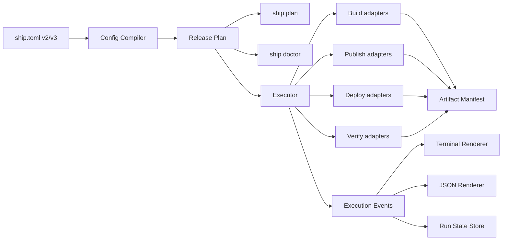

更稳妥的定义是：

> v3 = 从“按命令串联的发布工具”，升级为“以产物为中心、由计划驱动、可观测的发布执行器”。

其中 `v3.0.0` 负责建立新模型和架构基础，缓存、SBOM、容器化 step、可重复性验证等能力在 v3.x 上逐步完成。

我核对了 git 历史：最新正式 tag 确实是 `v2.5.0`，其后 HEAD 只有 Scoop manifest 更新。v2.0.0 到 v2.5.0 主要完成了配置模型、模板渲染、严格校验和分发收口，现在开启 v3 设计是合适的时间点。

## 一、建议的 v3 核心定位

建议将版本主题定为：

**ship v3：Artifact-centric Release Engine**

核心领域概念可以收敛为四个：

- **Artifact（产物）**：构建出来、可以发布和部署的不可变对象
- **Release（发布版本）**：源码版本和一组产物的组合
- **Environment（环境）**：staging、production 等部署目标
- **Run（执行实例）**：一次 plan/build/publish/deploy 的运行记录

目前 ship 的 profile 同时承担了一部分“构建变体”和“部署选择”职责，例如 [pipeline.go](C:/code/ship/cmd/pipeline.go:37) 会从多个 profile 中选择一个用于 deploy。v3 应明确拆开：

- profile = 构建变体，如 `brand-a`、`brand-b`
- environment = 部署目标，如 `staging`、`production`
- artifact = profile 构建出的结果
- release = 一组经过确认的 artifacts

这是我认为除了你已经列出的功能外，v3 最应该加入的一项领域调整。

## 二、建议的整体架构



这里最关键的不是增加多少 Go interface，而是建立几个真正有深度的 Module。

### 1. Config Compiler Module

将 `ship.toml` 编译成标准化的 Release Plan。

现在配置加载、默认值、字段推导和校验集中在 [config_load.go](C:/code/ship/internal/config_load.go:10)，但执行阶段仍然不断重新渲染配置、判断 driver 和拼装流程。

v3 中：

- v2/v3 配置都先转换成统一的内部模型
- 环境变量覆盖只在编译阶段处理一次
- 模板变量尽量在生成 Plan 时解析
- 后续 Module 不再直接理解 TOML 结构

这样可以保留 v2 兼容，而不让 v2 兼容逻辑污染所有 driver。

### 2. Release Plan Module

Plan 是 v3 最重要的 Module。

它应包含：

- 解析后的版本、profile、environment
- 将执行的阶段和 action
- 每个 action 的输入、输出、依赖
- 是否产生外部副作用
- 所需工具和能力
- 预期产生的 artifacts
- 并发限制和执行条件

然后：

- `ship plan` 负责展示它
- `ship plan --json` 负责输出给 CI
- `ship doctor` 根据它检查运行条件
- `ship run` 执行同一个 Plan
- 测试也直接验证 Plan

当前 `run` 在命令层手工计算阶段并依次调用，[run.go](C:/code/ship/cmd/run.go:32)。Plan Module 可以把这部分复杂度集中起来，提升 locality。

### 3. Artifact Module

Artifact 不应只是配置里的 `outputs = [...]`。目前该字段已经存在，但没有进入执行链路，[config.go](C:/code/ship/internal/config.go:108)。

建议 Artifact Manifest 至少包含：

- artifact ID
- 类型：container-image、binary、directory、file、evidence
- version、profile、platform
- 本地路径或远端引用
- SHA-256 或 OCI digest
- source commit
- 构建时间
- builder 信息
- SBOM/provenance 引用
- 产生该 artifact 的 action ID

例如：

```text
release v3.0.0
├── app-image
│   ├── linux/amd64 → sha256:...
│   └── linux/arm64 → sha256:...
├── app-binary
│   └── linux/amd64 → sha256:...
├── app-image.sbom
└── app-image.provenance
```

publish 和 deploy 必须消费 Artifact，而不是重新根据版本字符串拼装路径或 tag。

### 4. Executor Module

Executor 统一负责：

- `context.Context`
- Ctrl+C 取消
- 子进程终止
- action 超时
- 有界并发
- fail-fast 或收集错误
- 生命周期和状态变化
- 事件发送
- 敏感信息脱敏

当前命令执行使用 `exec.Command`，[exec.go](C:/code/ship/internal/exec.go:29)，没有 Context，也直接向终端打印。v3 应把执行和展示拆开。

### 5. Execution Event Module

建议建立统一事件：

- RunStarted / RunFinished
- ActionStarted / ActionFinished
- CommandStarted / CommandOutput
- ArtifactProduced
- Warning
- RetryScheduled
- VerificationFailed
- DeploymentRolledBack

终端 UI、JSON 日志、历史存储都消费相同事件。

这样既能保持现在“简洁、克制”的终端风格，也能增加：

```powershell
ship run --output json
ship run --log-file .ship\runs\<run-id>.jsonl
```

不需要在每个 driver 里分别维护 PTerm、JSON 和历史逻辑。

## 三、v3.0.0 应该包含什么

### 必须进入 v3.0.0

| 能力 | 原因 |
|---|---|
| schema 3 和 v2 配置迁移 | 新领域模型需要配置承载 |
| Release Plan | plan、doctor、执行统一的基础 |
| Artifact Manifest | v3 的核心价值 |
| Context 和取消 | 后续并发、超时、恢复的基础 |
| Execution Events | JSON、日志、历史、UI 的基础 |
| Driver Module 重构 | 当前 cmd 层不适合继续扩展 |
| 基础 `ship plan` | 验证新 Plan 模型 |
| 基础 `ship doctor` | 验证 Plan 的运行条件 |
| Secret 脱敏 | 结构化日志之前必须解决 |
| Run State Store | 保存 Plan、artifact 和执行结果 |
| profile/environment 分离 | 避免后续再做 schema 4 |

其中 Secret 脱敏很重要。当前 `RunCmd` 会打印完整命令行，而 Docker build args 也直接进入命令参数；如果 build args 中包含敏感内容，可能进入日志。这应该作为 v3 的安全基础，而不是后续优化。

### 适合进入 v3.1

- BuildKit `cache-from/cache-to`
- Docker 构建的 load/push/OCI output 模式
- 多平台镜像
- 并行 profile 构建
- 并行 registry publish
- Docker build secrets/SSH mount
- 镜像 digest 获取和部署
- 部署锁
- 从 Artifact Manifest 单独执行 publish/deploy

这些依赖 v3.0 的 Plan、Artifact 和 Executor。

### 适合进入 v3.2

- SBOM
- provenance
- 构建输入锁定检查
- 可重复性等级检查
- 容器化 step
- promotion：同一个 artifact 从 staging 提升到 production
- verify 失败后的可选自动回滚
- 断点重试安全阶段

这样可以避免 v3.0 同时重构架构、改变配置、实现并发、供应链安全和容器执行，风险过大。

## 四、你列出的功能应如何落地

### BuildKit 缓存

不只增加几个字符串字段，而应成为 Docker build adapter 的标准能力：

- local cache
- registry cache
- cache import/export
- cache mode
- cache namespace
- profile/platform 隔离
- CI 中的缓存策略

同时应支持三种输出策略：

- `load`：本地调试，单平台
- `push`：正式发布，可多平台
- `oci`：生成 OCI artifact

这样可以解除当前 [command.go](C:/code/ship/internal/command.go:54) 中“必须 `--load`、只能单平台”的约束。

### plan

建议区分：

```powershell
ship plan
ship plan --json
ship plan --environment production
ship plan --profile brand-a
```

Plan 必须保证无副作用。

不要另外实现一套 `--dry-run` 分支；`dry-run` 最好只是 Plan 的一种展示方式，否则真实执行和 dry-run 很容易产生行为漂移。

### doctor

建议分为两层：

```powershell
ship doctor
ship doctor --connect
```

默认只做本地检查：

- 配置和模板
- Docker/buildx/Go/SSH/SCP 版本
- 文件存在性
- builder 平台能力
- artifact 输出冲突
- 并行安全性
- secret 配置风险

`--connect` 才检查：

- registry 登录
- SSH 连接
- 远端目录
- Docker Compose 可用性
- 健康检查端点

### 容器化 step

应该提供，但必须受控。

建议只允许 step 选择执行方式：

```text
runner = host | container
```

容器 runner 配置可以有：

- image
- workdir
- workspace mount
- env
- secret mounts
- network policy
- outputs

明确不支持：

- step 依赖另一个任意 step
- 跨仓库 target
- 嵌套 workflow
- 用户自定义 DAG
- 用 step 重写 publish/deploy driver

这样可以获得 Earthly 的环境一致性，又不把 ship 变成 Earthfile。

### 并行矩阵

内部 Plan 可以是依赖图，但配置文件不暴露通用 DAG。

建议规则：

- 不同 profile 的 build 可以并行
- registry targets 可以并行
- SBOM 和部分验证可以并行
- deploy 默认串行
- 同一 environment 必须有部署锁
- hooks 默认视为不安全、串行
- 容器化且声明无副作用的 step 才能参与并行
- `max_parallel` 提供全局上限

### SBOM、provenance 和可重复性

不要对外宣传“ship 保证可重复构建”。建议定义为“构建可信度等级”：

1. **Recorded**：记录源码 commit、builder、输入和 artifact digest
2. **Pinned**：依赖文件、基础镜像等关键输入已锁定
3. **Attested**：生成 provenance
4. **Reproducible-checked**：独立构建两次并比较结果

SBOM 和 provenance 应作为 evidence artifact 附着在主 artifact 上，而不是几个零散文件路径。

对于 Docker 镜像优先复用 BuildKit 原生能力；对于 Go 二进制至少生成：

- SHA-256
- Go build info
- module/version 信息
- 可选 SBOM

双重构建验证成本较高，应是显式命令或 CI 选项，不应成为普通 `ship run` 默认行为。

## 五、建议额外加入的 v3 功能

### 1. Environment 与 artifact promotion

这是我最推荐新增的能力。

目标工作流：

```text
build once
→ publish artifact
→ deploy staging
→ verify
→ promote exact same digest
→ deploy production
```

不能在 production 部署时重新 build，否则 staging 验证的产物和 production 产物可能不是同一个。

### 2. 部署锁

防止两个 CI 同时向 production 部署。

锁应至少包含：

- project
- environment
- deploy driver
- owner/run ID
- 超时时间

本地文件锁只能解决同一台机器；正式环境最好支持远端锁或基于部署目录的锁。

### 3. 精确回滚

当前历史主要记录版本字符串，[history.go](C:/code/ship/internal/history.go:19)。

v3 应记录：

- release ID
- artifact digest
- environment
- deployment target
- previous release
- verification result
- run ID

回滚应部署历史中的准确 artifact，而不是根据 tag 重新推断。

### 4. 安全重试和恢复

不建议做“任意断点恢复”，而是按副作用分类：

- build：可以安全重试
- publish：通常可以幂等重试
- deploy：需要 driver 明确声明幂等性
- hooks：默认不可自动重试
- verify：可以重试，但不能改变部署状态

可以提供：

```powershell
ship retry <run-id>
ship deploy --release <release-id>
```

### 5. Policy 检查

不需要通用策略语言，可以先提供内置规则：

- production 不允许 `version = dev`
- production 必须使用 digest
- 禁止把 secret 作为 Docker build arg
- 基础镜像未锁 digest 时警告
- production 必须启用 verify
- production 必须生成 provenance
- `latest` 不能作为部署输入

保持内置规则优先，不引入 OPA 或表达式 DSL。

## 六、明确不进入 v3 的方向

为了保护 [design-principles.md](C:/code/ship/docs/design-principles.md:7) 里的产品定位，建议继续明确不做：

- 通用 DAG 配置
- Earthfile/Makefile 式 DSL
- CI webhook 和代码触发
- 内置 GitHub Actions/Jenkins 替代品
- 托管远程构建平台
- 通用插件市场
- Kubernetes 发布平台大一统
- 通用 secrets manager
- 缓存 deploy 副作用
- 任意表达式和脚本依赖关系

内部执行当然可以使用依赖图，但那是 Plan Module 的 implementation，不应成为用户必须理解的 interface。

## 七、版本与迁移策略

建议 v3 CLI 仍能读取 schema 2，但通过单独的兼容 adapter 转换：

```text
schema 2 config
→ v2 compatibility adapter
→ canonical v3 model
→ Release Plan
```

同时提供：

```powershell
ship migrate --to 3
ship migrate --to 3 --check
```

原则：

- v3 核心 Module 只理解 canonical v3 model
- v2 兼容逻辑集中在一个地方
- v2 配置可以继续运行一个大版本周期
- v3 新能力只对 schema 3 开放
- `.ship` 下的 manifest、run state 也必须带格式版本

## 八、推荐实施顺序

1. 定义 v3 领域词汇和 ADR
2. 引入 Config Compiler 和 Release Plan，保持现有行为不变
3. 让现有 `run/build/push/deploy` 全部执行 Plan
4. 引入 Context、Executor、Execution Events
5. 引入 Artifact Manifest 和 Run State Store
6. 重构 Docker/Go/publish/deploy adapters
7. 增加 plan、doctor 和 JSON 输出
8. 再做缓存、多平台和并行
9. 最后做 SBOM、provenance、容器化 step 和 promotion

所以我的最终判断是：

- **应该做 v3。**
- **你列出的能力都属于 v3 系列。**
- **v3.0.0 应聚焦 Plan、Artifact、Executor、Event、Environment 五个基础模型。**
- **缓存、并行、供应链安全和容器化 step 应建立在这些基础上，以 v3.1/v3.2 逐步交付。**
- **v3 的成功标准不是功能数量，而是以后增加 driver、产物类型和发布目标时，不再需要同时修改多个命令文件。**

本轮只完成了构思和仓库分析，没有修改任何文件。